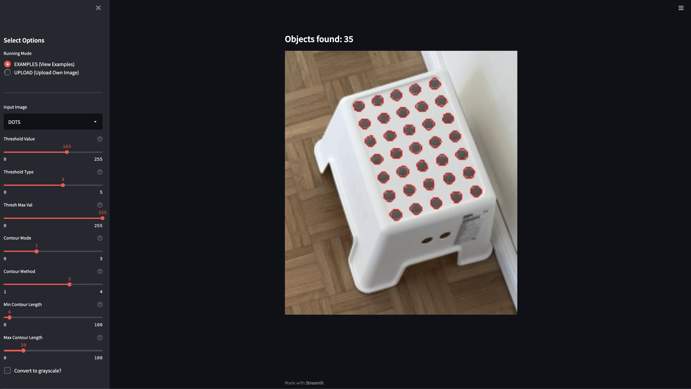

Streamlit Object Counter
========================
This repository contains a streamlit application that detects contours of objects on images and counts them.

### How?
The detection is based on a simple threshold scan followed by a countour finding algorithm, both taken from the
[opencv-python](https://pypi.org/project/opencv-python/) library. You can adjust many parameters manually to improve
performance of the outcome.

### What?
You can use this dashboard to count objects like birds. The color of these objects must be significantly different from
the background as the threshold scan is only performed on color differences.

### Why?
Have you ever asked yourself questions like "Wow, that are may {insert_arbitrary_object}s! I wonder how many that would
be. Dozends? Hundereds? Or even thousands?". Alternatively you want to perform a quick guessing game with your friends.
Everyone guesses a number of how many objects are on a given picture. The one who is closest to the real number wins.
Awesome!

### Screenshot?
Of course! If you don't want to upload an image by yourself, you can play around with the example images. Here is
how the interface looks like:

### Questions?
If you have further ideas do not hasitate to contact me via mail, timon.schmelzer@grandcentrix.net. Have fun!
